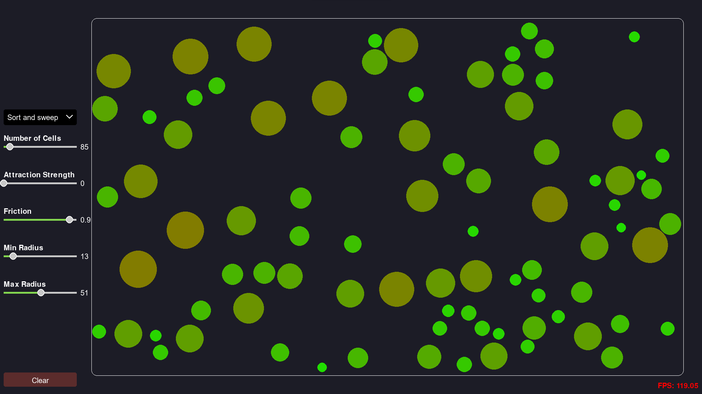

# Visualisation of cells moving in a confined 2D space

[demoCells.webm](https://github.com/Times0/Cells/assets/45049767/ab33c686-8397-497b-b496-4433bce159d5)

## Description

This is a simple physics simulation program that shows particles moving.
I implemented :

- Elastic collisions between particles
- Attractions between particles, (the greater the size of the particles, the greater the attraction)
- Friction in the air
- Different algorithms for handling the collision detection

## Collision detection algorithms

### Naive approach

For each particle, we check if it collides with any other particle.

Complexity: O(n^2)

### Sort and sweep

We sort the particles by their x coordinate. Then we check if any of the particles collide with the particles that are
on their left and right.

Complexity: O(nlogn)

### KD-Tree

We build a KD-Tree with the particles. Then we check if any of the particles collide with the particles that are in the
same leaf.

Complexity: O(nlogn)

## Conclusion

The naive approach is the simplest to implement, but it is also the slowest. The Sort and Sweep algorithm is faster and
easy to implement.
The KD-Tree is surprisingly slower than the Sweep and Prune algorithm and seems to do mistakes in the collision
detection with very small particles. 
